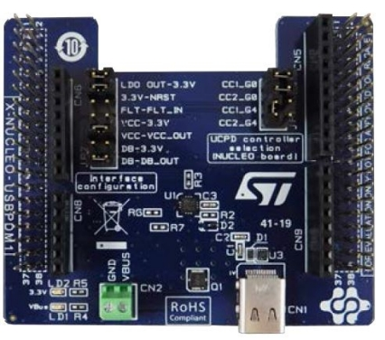

::: {.row}
::: {.col-sm-12 .col-lg-4}

# Release Notes for X-NUCLEO-USBPDM1
Copyright &copy; 2020 STMicroelectronics\
    
{.logo}

# License

This software component is licensed by ST under BSD 3-Clause license, the "License"; 
You may not use this component except in compliance with the License. You may obtain a copy of the License at:

[http://www.opensource.org/licenses/BSD-3-Clause](http://www.opensource.org/licenses/BSD-3-Clause)

# Purpose

The X-NUCLEO-USBPDM1 is an expansion board for the NUCLEO-G071RB and NUCLEO-G474RE development boards or any STM32 Nucleo development board equipped with a USB Type-C™ peripheral.

It provides a straightforward means for evaluating USB Type-C™ Power Delivery in SINK mode based on TCPP01-M12.
The USB Type-C connector can supply the STM32 Nucleo development board thanks to a 3.3 V LDO.

Further information are available here:

[https://www.st.com/en/ecosystems/x-nucleo-usbpdm1.html](https://www.st.com/en/ecosystems/x-nucleo-usbpdm1.html)

:::

::: {.col-sm-12 .col-lg-8}
# Update History

::: {.collapse}
<input type="checkbox" id="collapse-section2" checked aria-hidden="true">
<label for="collapse-section2" aria-hidden="true">V1.1.0 / 18-Dec.-2020</label>

## Main Changes

### Maintenance release

## Contents

**Fixed bugs list**

  Headline
  --------
    Update comment for BSP_USBPD_PWR_SetVBUSDisconnectionThreshold() function
    change to avoid over comsumption link with DB pin management
    Solve one warning in Keil (empty line at the end of a c file)

## Known Limitations

  Outstanding bugs list : None

  Requirements not met or planned in a forthcoming release : None

## Development Toolchains and Compilers

- IAR Embedded Workbench for ARM (EWARM) toolchain V8.32.3
- RealView Microcontroller Development Kit (MDK-ARM) toolchain V5.27.1.0
- STM32CubeIDE toolchain V1.2.1

## Supported Devices and boards

  The X-NUCLEO-USBPDM1 is an expansion board for the NUCLEO-G071RB and NUCLEO-G474RE.

## Backward compatibility

  No compatibility break with previous version

## Dependencies

:::

::: {.collapse}
<input type="checkbox" id="collapse-section1" aria-hidden="true">
<label for="collapse-section1" aria-hidden="true">V1.0.0 / 07-Apr.-2020</label>

## Main Changes

### Maintenance release

## Contents

**Fixed bugs list**

  Headline
  --------
  Initial release of BSP driver done for official certification on G0 + TCPP01  (SINK PPS 100W - TID3036)

  : Fixed bugs list

## Known Limitations

  Outstanding bugs list : None

  Requirements not met or planned in a forthcoming release : None

## Development Toolchains and Compilers

- IAR Embedded Workbench for ARM (EWARM) toolchain V8.32.3
- RealView Microcontroller Development Kit (MDK-ARM) toolchain V5.27.1.0
- STM32CubeIDE toolchain V1.2.1

## Supported Devices and boards

  The X-NUCLEO-USBPDM1 is an expansion board for the NUCLEO-G071RB and NUCLEO-G474RE.

## Backward compatibility

  No compatibility break with previous version

## Dependencies

:::

:::
:::

<footer class="sticky">
For complete documentation on STM32,visit: [[www.st.com/stm32](http://www.st.com)]

This release note uses up to date web standards and, for this reason, should not be opened with Internet Explorer
but preferably with popular browsers such as Google Chrome, Mozilla Firefox, Opera or Microsoft Edge.
</footer>
