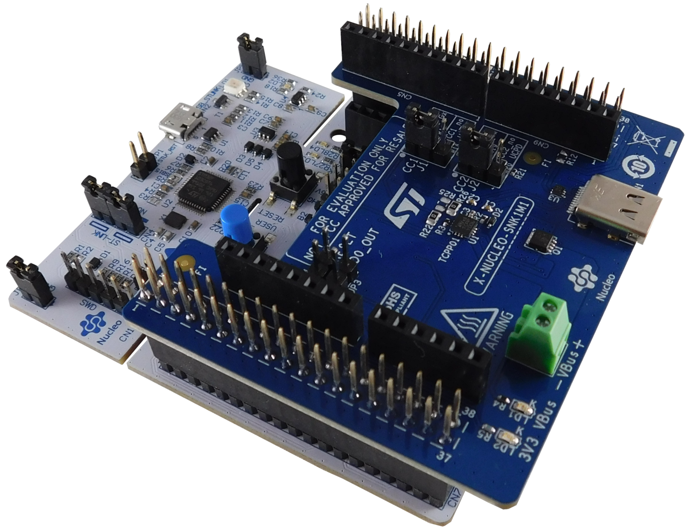
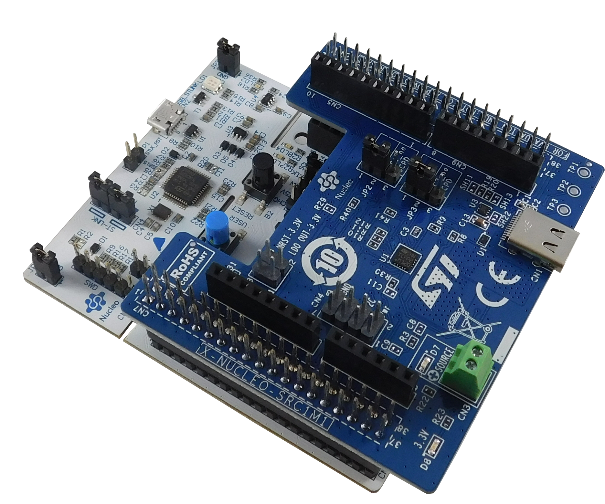
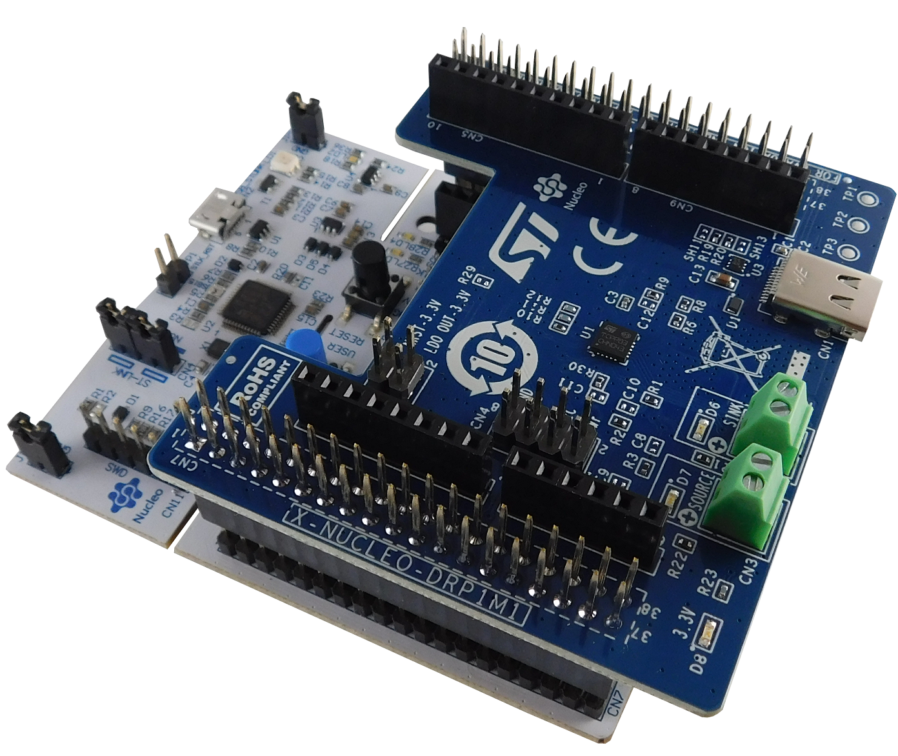

::: {.row}
::: {.col-sm-12 .col-lg-4}

# Release Notes for <mark>\<X-CUBE-TCPP\></mark>
Copyright &copy; 2020 STMicroelectronics\
    
{.logo}

# License

This software package is licensed by ST under SLA0048 the "License"; You may not use this component except in compliance
with the License. You may obtain a copy of the License at:

[st.com/SLA0048](http://www.st.com/SLA0048)

# Purpose

**X-CUBE-TCPP** is an STMicroelectronics original initiative. It uses for USB Type-C and Power Delivery software expansion for STM32Cube 
([UM2285](https://www.st.com/resource/en/user_manual/dm00432311-development-guidelines-for-stm32cube-expansion-packages-stmicroelectronics.pdf)).

**X-CUBE-TCPP** is a USB-IF certified Expansion Package (**USB Type-C Rev 1.2 and Power Delivery 3.0 with 100 W PPS support**) and consists of libraries, drivers, sources, APIs and application examples 
running on STM32 Series GP microcontrollers embedding Type-C and power delivery management (thanks to the embedded UCPD PHY integrated in STM32G4, STM32G0, STM32L5 or STM32U5).

For the other STM32 GP MCU without embedded UCPD PHY (like STM32L4, STM32F0...), this package demonstrates how to comply with Type-C specification. 

All the applications available in this package need to have either the [TCPP01-M12](https://www.st.com/en/protection-devices/tcpp01-m12.html) [TCPP02-M18](https://www.st.com/en/protection-devices/tcpp02-m18.html) or the [TCPP03-M20](https://www.st.com/en/protection-devices/tcpp03-m20.html) integrated. 

The TCPP01-M12 (Type-C port protection) is a single chip solution for USB Type-C port protection that facilitates the migration from USB legacy connectors type-A or type-B to USB Type-C connectors. 
The TCPP02-M18 (Type-C port protection) is a single chip solution for USB Type-C port protection in the context of Source applications. 
The TCPP03-M20 (Type-C port protection) is a single chip solution for USB Type-C port protection in the context of Dual Role Power applications. 

STMicroelectronics package has been certified by USB-IF through the reference [TID 3036](https://cms.usb.org/usb/cms/device/40004) and [TID 5205](https://cms.usb.org/usb_device/certificate/42552).   

Check the ST web page : [USB Type-C and Power Delivery](https://www.st.com/content/st_com/en/stm32-usb-c.html) for more details.

The figure below shows the overall architecture:

## Boards available
  * [NUCLEO-G071RB](https://www.st.com/en/evaluation-tools/nucleo-g071rb.html), [NUCLEO-G474RE](https://www.st.com/en/evaluation-tools/nucleo-g474re.html) and [NUCLEO-L412RB-P](https://www.st.com/en/evaluation-tools/nucleo-l412rb-p.html)

  * [X-NUCLEO-USBPDM1](https://www.st.com/content/st_com/en/products/ecosystems/stm32-open-development-environment/stm32-nucleo-expansion-boards/stm32-ode-power-drive-hw/x-nucleo-usbpdm1.html)
  

  
  * [X-NUCLEO-SNK1M1](https://www.st.com/content/st_com/en/products/ecosystems/stm32-open-development-environment/stm32-nucleo-expansion-boards/stm32-ode-power-drive-hw/x-nucleo-snk1m1.html)
  

  * [X-NUCLEO-SRC1M1](https://www.st.com/content/st_com/en/products/ecosystems/stm32-open-development-environment/stm32-nucleo-expansion-boards/stm32-ode-connect-hw/x-nucleo-src1m1.html)
  

  * [X-NUCLEO-DRP1M1](https://www.st.com/content/st_com/en/products/ecosystems/stm32-open-development-environment/stm32-nucleo-expansion-boards/stm32-ode-connect-hw/x-nucleo-drp1m1.html)
  

## Applications
|   Applications     |     Board     | Shield                     |       Short Description      |
|--------------------|---------------|----------------------------|------------------------------|
| [USBPDM1_Sink_PPS](./Projects/NUCLEO-G071RB/Applications/USB_PD/USBPDM1_Sink_PPS)| NUCLEO-G071RB | X-NUCLEO-USBPDM1|Use of USB Power Delivery (USB-PD) Consumer application (with **PPS**) running on STM32G0XX devices, with X-NUCLEO-USBPDM1 shield plugged.|
| [USBPDM1_Sink_LPM](./Projects/NUCLEO-G071RB/Applications/USB_PD/USBPDM1_Sink_LPM)| NUCLEO-G071RB | X-NUCLEO-USBPDM1|Use of USB Power Delivery (USB-PD) Consumer application (with **Low Power Mode**) running on STM32G0XX devices, with X-NUCLEO-USBPDM1 shield plugged.|
| [USBPDM1_Sink](./Projects/NUCLEO-G474RE/Applications/USB_PD/USBPDM1_Sink)| NUCLEO-G474RE | X-NUCLEO-USBPDM1|Use of USB Power Delivery (USB-PD) Consumer application running on STM32G4XX devices, with X-NUCLEO-USBPDM1 shield plugged.|
| [SNK1M1_Sink](./Projects/NUCLEO-G071RB/Applications/USB_PD/SNK1M1_Sink)| NUCLEO-G071RB | X-NUCLEO-SNK1M1|Use of USB Power Delivery (USB-PD) Consumer application (with **PPS**) running on STM32G0XX devices, with X-NUCLEO-SNK1M1 shield plugged.|
| [SNK1M1_Sink](./Projects/NUCLEO-G474RE/Applications/USB_PD/SNK1M1_Sink)| NUCLEO-G474RE | X-NUCLEO-SNK1M1|Use of USB Power Delivery (USB-PD) Consumer application (with **PPS** and **USB MSC** cohabitation) running on STM32G4XX devices, with X-NUCLEO-SNK1M1 shield plugged.|
| [SNK1M1_Sink_TypeC_Only](./Projects/NUCLEO-L412RB-P/Applications/USB_PD/SNK1M1_Sink_TypeC_Only)| NUCLEO-L412RB-P | X-NUCLEO-SNK1M1|Use of Type-C Consumer application (with **USB MSC** enumeration) running on STM32L4XX devices, with X-NUCLEO-SNK1M1 shield plugged.|
| [DRP1M1_DRP](./Projects/NUCLEO-G071RB/Applications/USB_PD/DRP1M1_DRP)| NUCLEO-G071RB | X-NUCLEO-DRP1M1|Use of USB Power Delivery (USB-PD) DRP application running on STM32G0XX devices, with X-NUCLEO-DRP1M1 shield plugged.|
| [DRP1M1_Sink_PPS](./Projects/NUCLEO-G071RB/Applications/USB_PD/DRP1M1_Sink_PPS)| NUCLEO-G071RB | X-NUCLEO-DRP1M1|Use of USB Power Delivery (USB-PD) Consumer application (with **PPS**) running on STM32G0XX devices, with X-NUCLEO-DRP1M1 shield plugged.|
| [DRP1M1_DRP](./Projects/NUCLEO-G474RE/Applications/USB_PD/DRP1M1_DRP)| NUCLEO-G474RE | X-NUCLEO-DRP1M1|Use of USB Power Delivery (USB-PD) DRP application running on STM32G4XX devices, with X-NUCLEO-DRP1M1 shield plugged.|
| [SRC1M1_Source](./Projects/NUCLEO-G071RB/Applications/USB_PD/SRC1M1_Source)| NUCLEO-G071RB | X-NUCLEO-SRC1M1|Use of USB Power Delivery (USB-PD) Source application running on STM32G0XX devices, with X-NUCLEO-SRC1M1 shield plugged.|
| [SRC1M1_Source](./Projects/NUCLEO-G474RE/Applications/USB_PD/SRC1M1_Source)| NUCLEO-G474RE | X-NUCLEO-DRP1M1|Use of USB Power Delivery (USB-PD) Source application running on STM32G4XX devices, with X-NUCLEO-SRC1M1 shield plugged.|

This Expansion Package is demonstrated on one hardware implementation, but can easily be ported to any STM32 including the UCPD periperal.

Here is the list of references to the user documents:

-   [AN5225](https://www.st.com/resource/en/application_note/dm00536349-usb-typec-power-delivery-using-stm32xx-series-mcus-and-stm32xxx-series-mpus-stmicroelectronics.pdf): [
    USB Type-C™ Power Delivery using STM32xx Series MCUs and STM32xxx Series MPUs]
-   [UM2552](https://www.st.com/resource/en/user_manual/dm00598101-managing-usb-power-delivery-systems-with-stm32-microcontrollers-stmicroelectronics.pdf): [
    Managing USB power delivery stack with STM32 microcontrollers]
-   [AN5418](https://www.st.com/resource/en/application_note/dm00663511-how-to-build-a-simple-usbpd-sink-application-with-stm32cubemx-stmicroelectronics.pdf): [
    An application to create a simple application from STM32CubeMX]
-   [AN5418-Video](https://www.youtube.com/watch?v=-vsJhNIaHxE&feature=youtu.be): [
    An application to create a simple application from STM32CubeMX]

:::

::: {.col-sm-12 .col-lg-8}
# Update history

::: {.collapse}
<input type="checkbox" id="collapse-section8" checked aria-hidden="true">
<label for="collapse-section8" aria-hidden="true">v3.2.0/ 22-December-2021</label>

			

## Main changes

### Maintenance release
Addition of projects highlighting use of TCPP02-M18 protection for USB-PD Source applications

  Headline
  ----------------------------------------------------------
  Update existing components to latest versions
  Addition of new projects for Source applications (running on NUCLEO-G071RB or NUCLEO-G474RE + X-NUCLEO-SRC1M1 shield)
  

## Contents

<small>The components flagged by "[]{.icon-st-update}" have changed since the
previous release. "[]{.icon-st-add}" are new.</small>

Components

  Name                                                        Version                                           License                                                                                                       Release note
  ----------------------------------------------------------- ------------------------------------------------- ------------------------------------------------------------------------------------------------------------- ------------------------------------------------------------------------------------------------------------------------------------------------
  STM32G0xx HAL Drivers                                       V1.4.2                                             [BSD-3-Clause](http://www.opensource.org/licenses/BSD-3-Clause)                                                [release note URL](Drivers/STM32G0xx_HAL_Driver/Release_Notes.html)
  STM32G0xx CMSIS                                             V1.4.1                                             [Apache-2.0](https://opensource.org/licenses/Apache-2.0)                                                       [release note URL](Drivers/CMSIS/Device/ST/STM32G0xx/Release_Notes.html)
  STM32G0xx_Nucleo                                            V1.1.1 []{.icon-st-update}                         [BSD-3-Clause](http://www.opensource.org/licenses/BSD-3-Clause)                                                [release note URL](Drivers/BSP/STM32G0xx_Nucleo/Release_Notes.html)
  STM32G4xx HAL Drivers                                       V1.2.2 []{.icon-st-update}                         [BSD-3-Clause](http://www.opensource.org/licenses/BSD-3-Clause)                                                [release note URL](Drivers/STM32G4xx_HAL_Driver/Release_Notes.html)
  STM32G4xx CMSIS                                             V1.2.2 []{.icon-st-update}                         [Apache-2.0](https://opensource.org/licenses/Apache-2.0)                                                       [release note URL](Drivers/CMSIS/Device/ST/STM32G4xx/Release_Notes.html)
  STM32G4xx_Nucleo                                            V1.0.4 []{.icon-st-update}                         [BSD-3-Clause](http://www.opensource.org/licenses/BSD-3-Clause)                                                [release note URL](Drivers/BSP/STM32G4xx_Nucleo/Release_Notes.html)
  STM32L4xx HAL Drivers                                       V1.12.0                                            [BSD-3-Clause](http://www.opensource.org/licenses/BSD-3-Clause)                                                [release note URL](Drivers/STM32L4xx_HAL_Driver/Release_Notes.html)
  STM32L4xx CMSIS                                             V1.7.0                                             [Apache-2.0](https://opensource.org/licenses/Apache-2.0)                                                       [release note URL](Drivers/CMSIS/Device/ST/STM32L4xx/Release_Notes.html)
  STM32L4xx_Nucleo                                            V2.1.6                                             [BSD-3-Clause](http://www.opensource.org/licenses/BSD-3-Clause)                                                [release note URL](Drivers/BSP/STM32L4xx_Nucleo/Release_Notes.html)
  TCPP03-M20 Component Driver                                 V1.2.1                                             [BSD-3-Clause](http://www.opensource.org/licenses/BSD-3-Clause)                                                [release note URL](Drivers/BSP/Components/tcpp0203/Release_Notes.html)
  X-NUCLEO-DRP1M1 BSP                                         V1.4.0 []{.icon-st-update}                         [BSD-3-Clause](http://www.opensource.org/licenses/BSD-3-Clause)                                                [release note URL](Drivers/BSP/X-NUCLEO-DRP1M1/Release_Notes.html)
  X-NUCLEO-SRC1M1 BSP                                         V1.0.0 []{.icon-st-add}                            [BSD-3-Clause](http://www.opensource.org/licenses/BSD-3-Clause)                                                [release note URL](Drivers/BSP/X-NUCLEO-SRC1M1/Release_Notes.html)
  X-NUCLEO-USBPDM1 BSP                                        V1.2.0 []{.icon-st-update}                         [BSD-3-Clause](http://www.opensource.org/licenses/BSD-3-Clause)                                                [release note URL](Drivers/BSP/X-NUCLEO-USBPDM1/Release_Notes.html)
  GUI_INTERFACE                                               V2.2.0 []{.icon-st-update}                         [SLA0044](https://www.st.com/sla0044)                                                                          [release note URL](Utilities/GUI_INTERFACE/Release_Notes.html)
  TRACER_EMB                                                  V1.7.1 []{.icon-st-update}                         [SLA0044](https://www.st.com/sla0044)                                                                          [release note URL](Utilities/TRACER_EMB/Release_Notes.html)
  STM32_USBPD_Library/CORE                                    V4.1.0 []{.icon-st-update}                         [SLA0044](https://www.st.com/sla0044)                                                                          [release note URL](Middlewares/ST/STM32_USBPD_Library/Core/Release_Notes.html)
  STM32_USBPD_Library/DEVICES_G0                              v3.4.0 []{.icon-st-update}                         [SLA0044](https://www.st.com/sla0044)                                                                          [release note URL](Middlewares/ST/STM32_USBPD_Library/Devices/STM32G0XX\Release_Notes.html)
  STM32_USBPD_Library/DEVICES_G4                              v5.2.0 []{.icon-st-update}                         [SLA0044](https://www.st.com/sla0044)                                                                          [release note URL](Middlewares/ST/STM32_USBPD_Library/Devices/STM32G4XX\Release_Notes.html)

## Known limitations

No known limitations

## Development toolchains and compilers

- [IAR Embedded Workbench for ARM] [EWARM V8.50.6 + STLink/V2]
- [RealView Microcontroller Development Kit] [MDK-ARM V5.31 + ST-LINK/V2]
- [STM32CubeIDE] [V1.7.0 + ST-LINK/V2](https://www.st.com/en/development-tools/stm32cubeide.html)

## Supported devices and boards

- NUCLEO-G071RB, NUCLEO-G474RE and NUCLEO-L412RB-P
- X-NUCLEO-USBPDM1
- X-NUCLEO-SNK1M1 
- X-NUCLEO-SRC1M1 
- X-NUCLEO-DRP1M1 

## Backward compatibility

Not applicable

:::

::: {.collapse}
<input type="checkbox" id="collapse-section7" aria-hidden="true">
<label for="collapse-section7" aria-hidden="true">v3.1.0/ 22-October-2021</label>

			

## Main changes

### Maintenance release
Maintenance release and product update

  Headline
  ----------------------------------------------------------
  Update X-NUCLEO-DRP1M1 BSP to support current sensing (measurement available in STM32CubeMonitor-UCPD)
  Update X-NUCLEO-DRP1M1 related projects to support current sensing added feature
  Update X-NUCLEO-DRP1M1 related projects with example .ioc (CubeMX) files (not to be used for project generation)
  Protect GUI and Tracer related includes/code sections, by corresponding compilation flags

## Contents

<small>The components flagged by "[]{.icon-st-update}" have changed since the
previous release. "[]{.icon-st-add}" are new.</small>

Components

  Name                                                        Version                                           License                                                                                                       Release note
  ----------------------------------------------------------- ------------------------------------------------- ------------------------------------------------------------------------------------------------------------- ------------------------------------------------------------------------------------------------------------------------------------------------
  STM32G0xx HAL Drivers                                       V1.4.2                                             [BSD-3-Clause](http://www.opensource.org/licenses/BSD-3-Clause)                                                [release note URL](Drivers/STM32G0xx_HAL_Driver/Release_Notes.html)
  STM32G0xx CMSIS                                             V1.4.1                                             [Apache-2.0](https://opensource.org/licenses/Apache-2.0)                                                       [release note URL](Drivers/CMSIS/Device/ST/STM32G0xx/Release_Notes.html)
  TCPP03-M20 Component Driver                                 V1.2.1                                             [BSD-3-Clause](http://www.opensource.org/licenses/BSD-3-Clause)                                                [release note URL](Drivers/BSP/Components/tcpp0203/Release_Notes.html)
  X-NUCLEO-DRP1M1 BSP                                         V1.3.0 []{.icon-st-update}                         [BSD-3-Clause](http://www.opensource.org/licenses/BSD-3-Clause)                                                [release note URL](Drivers/BSP/X-NUCLEO-DRP1M1/Release_Notes.html)
  GUI_INTERFACE                                               V2.0.0                                             [SLA0044](https://www.st.com/sla0044)                                                                          [release note URL](Utilities/GUI_INTERFACE/Release_Notes.html)
  TRACER_EMB                                                  V1.6.1                                             [SLA0044](https://www.st.com/sla0044)                                                                          [release note URL](Utilities/TRACER_EMB/Release_Notes.html)
  STM32_USBPD_Library/CORE                                    V4.0.0                                             [SLA0044](https://www.st.com/sla0044)                                                                          [release note URL](Middlewares/ST/STM32_USBPD_Library/Core/Release_Notes.html)
  STM32_USBPD_Library/DEVICES_G0                              v3.3.1                                             [SLA0044](https://www.st.com/sla0044)                                                                          [release note URL](Middlewares/ST/STM32_USBPD_Library/Devices/STM32G0XX\Release_Notes.html)
  STM32_USBPD_Library/DEVICES_G4                              v5.1.0                                             [SLA0044](https://www.st.com/sla0044)                                                                          [release note URL](Middlewares/ST/STM32_USBPD_Library/Devices/STM32G4XX\Release_Notes.html)

## Known limitations

Outstanding bugs list

## Development toolchains and compilers

- [IAR Embedded Workbench for ARM] [EWARM V8.50.6 + STLink/V2]
- [RealView Microcontroller Development Kit] [MDK-ARM V5.31 + ST-LINK/V2]
- [STM32CubeIDE] [V1.7.0 + ST-LINK/V2](https://www.st.com/en/development-tools/stm32cubeide.html)

## Supported devices and boards

- NUCLEO-G071RB, NUCLEO-G474RE and NUCLEO-L412RB-P
- X-NUCLEO-USBPDM1
- X-NUCLEO-SNK1M1 
- X-NUCLEO-DRP1M1 

## Backward compatibility

Not applicable

:::

::: {.collapse}
<input type="checkbox" id="collapse-section6" aria-hidden="true">
<label for="collapse-section6" aria-hidden="true">v3.0.0/ 06-July-2021</label>

			

## Main changes

### Maintenance release
Maintenance release and product update

  Headline
  ----------------------------------------------------------
  Add support of X-NUCLEO-DRP1M1 (TCPP03-M20) for NUCLEO-G071RB and NUCLEO-G474RE boards
  [Add DRP application based on X-NUCLEO-DRP1M1 for G0](Projects/NUCLEO-G071RB/Applications/USB_PD/DRP1M1_DRP/readme.txt)
  [Add Sink PPS application based on X-NUCLEO-DRP1M1 for G0](Projects/NUCLEO-G071RB/Applications/USB_PD/DRP1M1_Sink_PPS/readme.txt)
  [Add DRP application based on X-NUCLEO-DRP1M1 for G4](Projects/NUCLEO-G474RE/Applications/USB_PD/DRP1M1_DRP/readme.txt)
  Update USBPD Core stack library version to V4.0.0 and update of USBPD Device drivers for G0 and G4
  Update GUI_INTERFACE version to V2.0.0
  Update TRACER_EMB version to V1.6.1

## Contents

<small>The components flagged by "[]{.icon-st-update}" have changed since the
previous release. "[]{.icon-st-add}" are new.</small>

Components

  Name                                                        Version                                           License                                                                                                       Release note
  ----------------------------------------------------------- ------------------------------------------------- ------------------------------------------------------------------------------------------------------------- ------------------------------------------------------------------------------------------------------------------------------------------------
  STM32G0xx HAL Drivers                                       V1.4.2 []{.icon-st-update}                         [BSD-3-Clause](http://www.opensource.org/licenses/BSD-3-Clause)                                                [release note URL](Drivers/STM32G0xx_HAL_Driver/Release_Notes.html)
  STM32G0xx CMSIS                                             V1.4.1 []{.icon-st-update}                         [Apache-2.0](https://opensource.org/licenses/Apache-2.0)                                                       [release note URL](Drivers/CMSIS/Device/ST/STM32G0xx/Release_Notes.html)
  TCPP03-M20 Component Driver                                 V1.2.1 []{.icon-st-add}                            [BSD-3-Clause](http://www.opensource.org/licenses/BSD-3-Clause)                                                [release note URL](Drivers/BSP/Components/tcpp0203/Release_Notes.html)
  X-NUCLEO-DRP1M1 BSP                                         V1.1.0 []{.icon-st-add}                            [BSD-3-Clause](http://www.opensource.org/licenses/BSD-3-Clause)                                                [release note URL](Drivers/BSP/X-NUCLEO-DRP1M1/Release_Notes.html)
  GUI_INTERFACE                                               V2.0.0 []{.icon-st-update}                         [SLA0044](https://www.st.com/sla0044)                                                                          [release note URL](Utilities/GUI_INTERFACE/Release_Notes.html)
  TRACER_EMB                                                  V1.6.1 []{.icon-st-update}                         [SLA0044](https://www.st.com/sla0044)                                                                          [release note URL](Utilities/TRACER_EMB/Release_Notes.html)
  STM32_USBPD_Library/CORE                                    V4.0.0 []{.icon-st-update}                         [SLA0044](https://www.st.com/sla0044)                                                                          [release note URL](Middlewares/ST/STM32_USBPD_Library/Core/Release_Notes.html)
  STM32_USBPD_Library/DEVICES_G0                              v3.3.1 []{.icon-st-update}                         [SLA0044](https://www.st.com/sla0044)                                                                          [release note URL](Middlewares/ST/STM32_USBPD_Library/Devices/STM32G0XX\Release_Notes.html)
  STM32_USBPD_Library/DEVICES_G4                              v5.1.0 []{.icon-st-update}                         [SLA0044](https://www.st.com/sla0044)                                                                          [release note URL](Middlewares/ST/STM32_USBPD_Library/Devices/STM32G4XX\Release_Notes.html)

## Known limitations

Outstanding bugs list

## Development toolchains and compilers

- [IAR Embedded Workbench for ARM] [EWARM V8.50.6 + STLink/V2]
- [RealView Microcontroller Development Kit] [MDK-ARM V5.31 + ST-LINK/V2]
- [STM32CubeIDE] [V1.7.0 + ST-LINK/V2](https://www.st.com/en/development-tools/stm32cubeide.html)

## Supported devices and boards

- NUCLEO-G071RB, NUCLEO-G474RE and NUCLEO-L412RB-P
- X-NUCLEO-USBPDM1
- X-NUCLEO-SNK1M1 
- X-NUCLEO-DRP1M1 

## Backward compatibility

Not applicable

:::

::: {.collapse}
<input type="checkbox" id="collapse-section5" aria-hidden="true">
<label for="collapse-section5" aria-hidden="true">v2.2.0/ 18-February-2021</label>

			

## Main changes

### Maintenance release
Maintenance release and product update

  Headline
  ----------------------------------------------------------
  [Add Sink application based on X-NUCLEO-SNK1M1 for G0](Projects/NUCLEO-G071RB/Applications/USB_PD/SNK1M1_Sink/readme.txt)
  [Add Sink application based on X-NUCLEO-SNK1M1 for G4](Projects/NUCLEO-G474RE/Applications/USB_PD/SNK1M1_Sink/readme.txt)
  [Add Type-C application based on X-NUCLEO-SNK1M1 for L4](Projects/NUCLEO-L412RB-P/Applications/USB_PD/SNK1M1_Sink_TypeC_Only/readme.txt)
  Rename applications forX-NUCLEO-USBPDM1 (Consumer -> Sink)

## Contents

<small>The components flagged by "[]{.icon-st-update}" have changed since the
previous release. "[]{.icon-st-add}" are new.</small>

Components

  Name                                                        Version                                           License                                                                                                       Release note
  ----------------------------------------------------------- ------------------------------------------------- ------------------------------------------------------------------------------------------------------------- ------------------------------------------------------------------------------------------------------------------------------------------------
  STM32G0xx HAL Drivers                                       V1.4.0 []{.icon-st-update}                         [BSD-3-Clause](http://www.opensource.org/licenses/BSD-3-Clause)                                                [release note URL](Drivers/STM32G0xx_HAL_Driver/Release_Notes.html)
  STM32L4xx HAL Drivers                                       V1.12.0 []{.icon-st-add}                           [BSD-3-Clause](http://www.opensource.org/licenses/BSD-3-Clause)                                                [release note URL](Drivers/STM32L4xx_HAL_Driver/Release_Notes.html)
  STM32L4xx CMSIS                                             V1.7.0 []{.icon-st-add}                            [Apache-2.0](https://opensource.org/licenses/Apache-2.0)                                                       [release note URL](Drivers/CMSIS/Device/ST/STM32L4xx/Release_Notes.html)
  STM32L4xx_Nucleo                                            V2.1.6 []{.icon-st-add}                            [BSD-3-Clause](http://www.opensource.org/licenses/BSD-3-Clause)                                                [release note URL](Drivers/BSP/STM32L4xx_Nucleo/Release_Notes.html)
  STM32_USB_Device_Library                                    V2.6.0 []{.icon-st-add}                            [SLA0044](https://www.st.com/sla0044)                                                                             [release note URL](Middlewares/ST/STM32_USB_Device_Library/Release_Notes.html)
  GUI_INTERFACE                                               V1.13.0 []{.icon-st-update}                        [SLA0044](https://www.st.com/sla0044)                                                                             [release note URL](Utilities/GUI_INTERFACE/Release_Notes.html)
  STM32_USBPD_Library/CORE                                         V3.3.1 []{.icon-st-update}                         [SLA0044](https://www.st.com/sla0044)                                                                             [release note URL](Middlewares/ST/STM32_USBPD_Library/Core/Release_Notes.html)
  STM32_USBPD_Library/DEVICES_G0                                         g0_v3.2.1 []{.icon-st-update}                         [SLA0044](https://www.st.com/sla0044)                                                                             [release note URL](Middlewares\ST\STM32_USBPD_Library\Devices\STM32G0XX\Release_Notes.html)

## Known limitations

Outstanding bugs list

## Development toolchains and compilers

- [IAR Embedded Workbench for ARM] [EWARM V8.50.4 + STLink/V2]
- [RealView Microcontroller Development Kit] [MDK-ARM V5.25.2 + ST-LINK/V2]
- [STM32CubeIDE] [V1.6.0 + ST-LINK/V2](https://www.st.com/en/development-tools/stm32cubeide.html)

## Supported devices and boards

- NUCLEO-G071RB, NUCLEO-G474RE and NUCLEO-L412RB-P
- X-NUCLEO-USBPDM1
- X-NUCLEO-SNK1M1 

## Backward compatibility

Not applicable

:::

::: {.collapse}
<input type="checkbox" id="collapse-section4" aria-hidden="true">
<label for="collapse-section4" aria-hidden="true">v2.1.0/ 18-December-2020</label>

			

## Main changes

### Maintenance release
Maintenance release and product update

  Headline
  ----------------------------------------------------------
  [One low power application added for G0](Projects/NUCLEO-G071RB/Applications/USB_PD/USBPDM1_Consumer_LPM/readme.txt)
  Rename BSP Board P-NUCLEO-USBPM1 to X-NUCLEO-USBPM1
  Rename G0 and G4 applications TCPP01_Consumer_PPS to USBPDM1_Consumer_PPS

## Contents

<small>The components flagged by "[]{.icon-st-update}" have changed since the
previous release. "[]{.icon-st-add}" are new.</small>

Components

  Name                                                        Version                                           License                                                                                                       Release note
  ----------------------------------------------------------- ------------------------------------------------- ------------------------------------------------------------------------------------------------------------- ------------------------------------------------------------------------------------------------------------------------------------------------
  STM32G4xx HAL Drivers                                       V1.2.0 []{.icon-st-update}                         [BSD-3-Clause](http://www.opensource.org/licenses/BSD-3-Clause)                                                   [release note URL](Drivers/STM32G4xx_HAL_Driver/Release_Notes.html)
  STM32G4xx CMSIS                                             V1.2.0 []{.icon-st-update}                         [Apache-2.0](https://opensource.org/licenses/Apache-2.0)                                                       [release note URL](Drivers/CMSIS/Device/ST/STM32G4xx/Release_Notes.html)
  X-NUCLEO-USBPDM1 BSP                                        V1.1.0 []{.icon-st-update}                         [BSD-3-Clause](http://www.opensource.org/licenses/BSD-3-Clause)                                                   [release note URL](Drivers/BSP/X-NUCLEO-USBPDM1/Release_Notes.html)
  GUI_INTERFACE                                               V1.10.0 []{.icon-st-update}                        [SLA0044](https://www.st.com/sla0044)                                                                             [release note URL](Utilities/GUI_INTERFACE/Release_Notes.html)
  TRACER_EMB                                                  V1.3.0 []{.icon-st-update}                         [BSD-3-Clause](http://www.opensource.org/licenses/BSD-3-Clause)                                                [release note URL](Utilities/TRACER_EMB/Release_Notes.html)
  STM32_USBPD_Library                                         V3.2.0 []{.icon-st-update}                         [SLA0044](https://www.st.com/sla0044)                                                                             [release note URL](Middlewares/ST/STM32_USBPD_Library/Core/Release_Notes.html)

## Known limitations

Outstanding bugs list

## Development toolchains and compilers

- [IAR Embedded Workbench for ARM] [EWARM V8.32.3 + STLink/V2]
- [RealView Microcontroller Development Kit] [MDK-ARM V5.25.2 + ST-LINK/V2]
- [STM32CubeIDE] [V1.5.0 + ST-LINK/V2](https://www.st.com/en/development-tools/stm32cubeide.html)

## Supported devices and boards

- NUCLEO-G071RB and NUCLEO-G474RE
- X-NUCLEO-USBPDM1

## Backward compatibility

Not applicable

:::

::: {.collapse}
<input type="checkbox" id="collapse-section3" aria-hidden="true">
<label for="collapse-section3" aria-hidden="true">v2.0.1 / 01-July-2020</label>

			

## Main changes

### Maintenance release
Maintenance release and product update

  Headline
  ----------------------------------------------------------
  Changed USART1 to LPUART1 for G4 project, to match with MB1367-G474RE-C04 hardware version

## Contents

<small>The components flagged by "[]{.icon-st-update}" have changed since the
previous release. "[]{.icon-st-add}" are new.</small>

Components

  Name                                                        Version                                           License                                                                                                       Release note
  ----------------------------------------------------------- ------------------------------------------------- ------------------------------------------------------------------------------------------------------------- ------------------------------------------------------------------------------------------------------------------------------------------------
  STM32_USBPD_Library                                         V3.0.0 []{.icon-st-update}                         [SLA0044](https://www.st.com/sla0044)                                                                             [release note URL](Middlewares/ST/STM32_USBPD_Library/Core/Release_Notes.html)
  G0 Devices                                                  V3.0.0 []{.icon-st-update}                         [SLA0044](https://www.st.com/sla0044)                                                                             [release note URL](Middlewares/ST/STM32_USBPD_Library/Devices/STM32G0XX/Release_Notes.html)

## Known limitations

Outstanding bugs list

## Development toolchains and compilers

- [IAR Embedded Workbench for ARM] [EWARM V8.32.3 + STLink/V2]
- [RealView Microcontroller Development Kit] [MDK-ARM V5.25.2 + ST-LINK/V2]
- [STM32CubeIDE] [V1.5.0 + ST-LINK/V2](https://www.st.com/en/development-tools/stm32cubeide.html)

## Supported devices and boards

- NUCLEO-G071RB and NUCLEO-G474RE
- X-NUCLEO-USBPDM1

## Backward compatibility

Not applicable

:::

::: {.collapse}
<input type="checkbox" id="collapse-section2" aria-hidden="true">
<label for="collapse-section2" aria-hidden="true">v2.0.0 / 15-June-2020</label>

			

## Main changes

### Maintenance release
Maintenance release and product update

  Headline
  ----------------------------------------------------------
  G4 project added

## Contents

<small>The components flagged by "[]{.icon-st-update}" have changed since the
previous release. "[]{.icon-st-add}" are new.</small>

## Known limitations

Outstanding bugs list

## Development toolchains and compilers

- [IAR Embedded Workbench for ARM] [EWARM V8.32.3 + STLink/V2]
- [RealView Microcontroller Development Kit] [MDK-ARM V5.25.2 + ST-LINK/V2]
- [STM32CubeIDE] [V1.5.0 + ST-LINK/V2](https://www.st.com/en/development-tools/stm32cubeide.html)

## Supported devices and boards

- NUCLEO-G071RB and NUCLEO-G474RE
- X-NUCLEO-USBPDM1

## Backward compatibility

Not applicable

:::

::: {.collapse}
<input type="checkbox" id="collapse-section1" aria-hidden="true">
<label for="collapse-section1" aria-hidden="true">v1.0.0/ 01-May-2020</label>

			

## Main changes

### Maintenance release
Initial release

  Headline
  ----------------------------------------------------------
  Initial release

## Contents

<small>The components flagged by "[]{.icon-st-update}" have changed since the
previous release. "[]{.icon-st-add}" are new.</small>

Components

  Name                                                        Version                                           License                                                                                                       Release note
  ----------------------------------------------------------- ------------------------------------------------- ------------------------------------------------------------------------------------------------------------- ------------------------------------------------------------------------------------------------------------------------------------------------
  STM32G0xx HAL Drivers                                       V1.3.0 []{.icon-st-add}                            [BSD-3-Clause](http://www.opensource.org/licenses/BSD-3-Clause)                                                   [release note URL](Drivers/STM32G0xx_HAL_Driver/Release_Notes.html)
  STM32G4xx HAL Drivers                                       V1.2.0RC1 []{.icon-st-add}                         [BSD-3-Clause](http://www.opensource.org/licenses/BSD-3-Clause)                                                   [release note URL](Drivers/STM32G4xx_HAL_Driver/Release_Notes.html)
  STM32G0xx CMSIS                                             V1.3.0 []{.icon-st-add}                            [Apache-2.0](https://opensource.org/licenses/Apache-2.0)                                                         [release note URL](Drivers/CMSIS/Device/ST/STM32G4xx/Release_Notes.html)
  STM32G4xx CMSIS                                             V1.2.0 []{.icon-st-add}                            [Apache-2.0](https://opensource.org/licenses/Apache-2.0)                                                         [release note URL](Drivers/CMSIS/Device/ST/STM32G4xx/Release_Notes.html)
  X-NUCLEO-USBPDM1 BSP                                        V1.0.0 []{.icon-st-add}                            [BSD-3-Clause](http://www.opensource.org/licenses/BSD-3-Clause)                                                   [release note URL](Drivers/BSP/X-NUCLEO-USBPDM1/Release_Notes.html)
  STM32G0xx_Nucleo                                            V1.1.0 []{.icon-st-add}                            [BSD-3-Clause](http://www.opensource.org/licenses/BSD-3-Clause)                                               [release note URL](Drivers/BSP/STM32G0xx_Nucleo/Release_Notes.html)
  STM32G4xx_Nucleo                                            V1.0.0 []{.icon-st-add}                            [BSD-3-Clause](http://www.opensource.org/licenses/BSD-3-Clause)                                               [release note URL](Drivers/BSP/STM32G4xx_Nucleo/Release_Notes.html)
  GUI_INTERFACE                                               V1.10.0 []{.icon-st-add}                           [SLA0044](https://www.st.com/sla0044)                                                                             [release note URL](Utilities/GUI_INTERFACE/Release_Notes.html)
  TRACER_EMB                                                  V1.3.0 []{.icon-st-add}                            [BSD-3-Clause](http://www.opensource.org/licenses/BSD-3-Clause)                                                  [release note URL](Utilities/TRACER_EMB/Release_Notes.html)
  STM32_USBPD_Library                                         V3.0.0 []{.icon-st-add}                            [SLA0044](https://www.st.com/sla0044)                                                                             [release note URL](Middlewares/ST/STM32_USBPD_Library/Core/Release_Notes.html)
  G0 Devices                                                  V3.0.0 []{.icon-st-add}                            [SLA0044](https://www.st.com/sla0044)                                                                             [release note URL](Middlewares/ST/STM32_USBPD_Library/Devices/STM32G0XX/Release_Notes.html)

## Known limitations

Outstanding bugs list

## Development toolchains and compilers

- [IAR Embedded Workbench for ARM] [EWARM V8.32.3 + STLink/V2]
- [RealView Microcontroller Development Kit] [MDK-ARM V5.25.2 + ST-LINK/V2]
- [STM32CubeIDE] [V1.5.0 + ST-LINK/V2](https://www.st.com/en/development-tools/stm32cubeide.html)

## Supported devices and boards

- NUCLEO-G071RB and NUCLEO-G474RE
- X-NUCLEO-USBPDM1

## Backward compatibility

Not applicable

:::

:::
:::

<footer class="sticky">
::: {.columns}
::: {.column width="95%"}
For complete documentation on **STM32 Series** ,
visit: [www.st.com/STM32](http://www.st.com/STM32)]
:::
::: {.column width="5%"}
<abbr title="Based on template cx566953 version 2.0">Info</abbr>
:::
:::
</footer>
